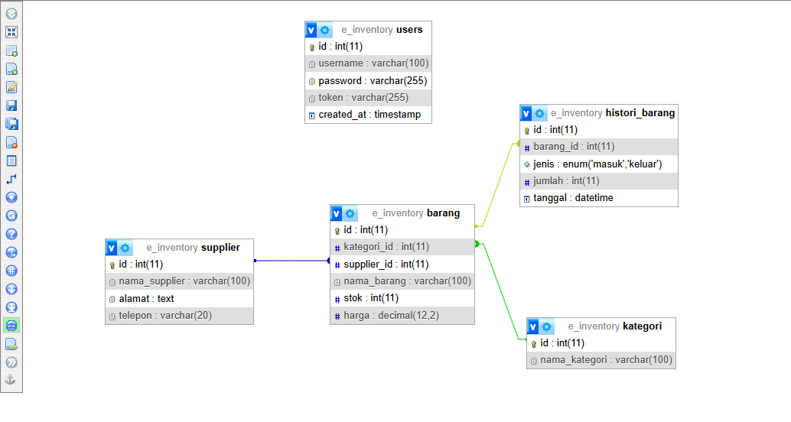
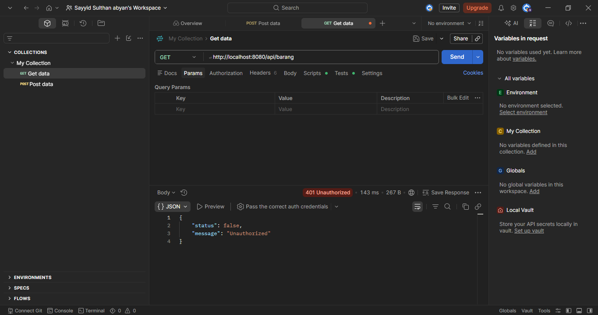
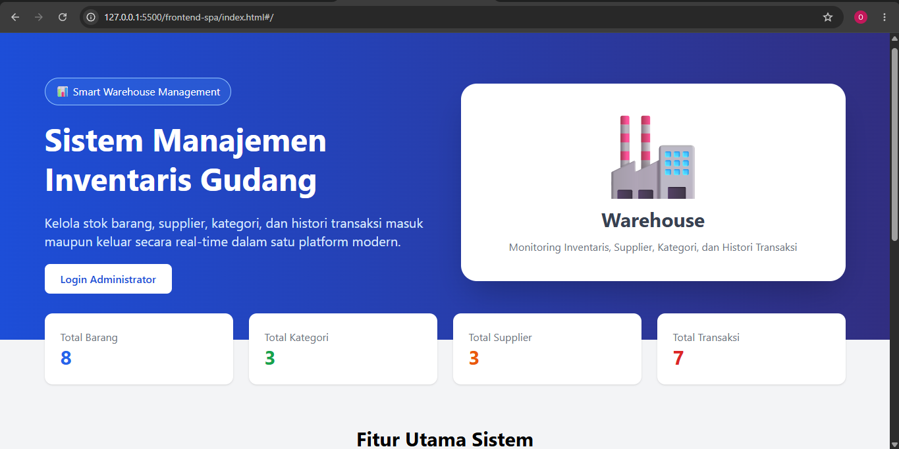
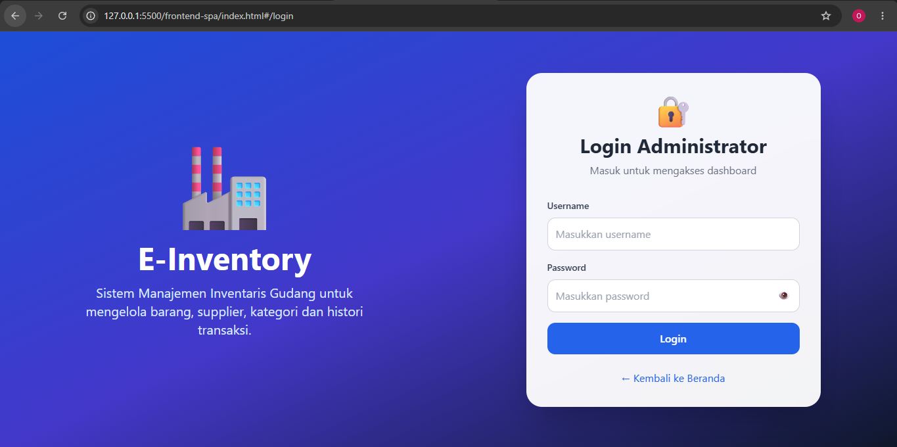
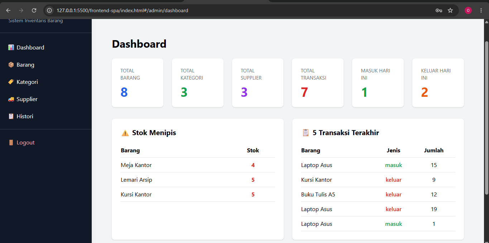
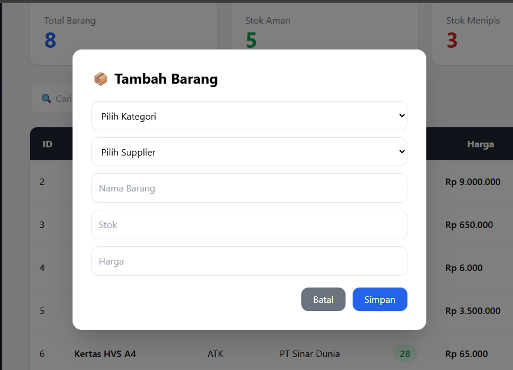
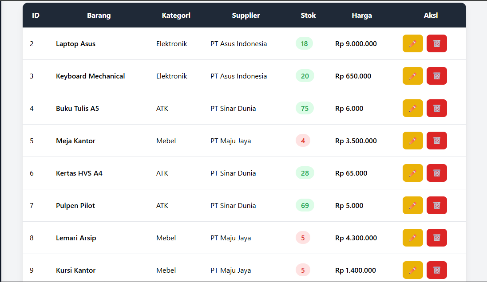
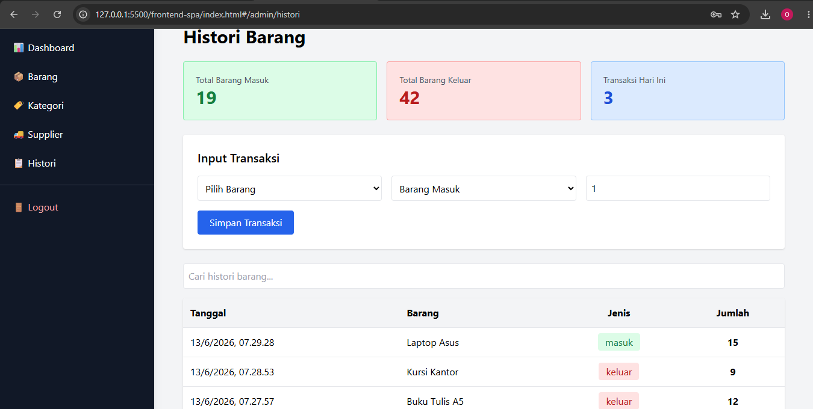

# E-Inventory (Sistem Manajemen Inventaris Barang)

## UAS Pemrograman Web 2

**Nama:** Sayyid Sulthan Abyan

**NIM:** 312410496

**Mata Kuliah:** Pemrograman Web 2

---

## Deskripsi Proyek

E-Inventory adalah aplikasi Sistem Manajemen Inventaris Barang berbasis Decoupled Architecture yang memisahkan Backend API dan Frontend SPA secara penuh.

Aplikasi digunakan untuk mengelola data inventaris barang, kategori, supplier, stok, serta histori transaksi barang masuk dan keluar.

Backend dibangun menggunakan CodeIgniter 4 sebagai RESTful API Server, sedangkan frontend dibangun menggunakan VueJS 3 Single Page Application (SPA) dengan Vue Router, Axios, dan TailwindCSS.

---

## Teknologi yang Digunakan

### Backend

* PHP 8.x
* CodeIgniter 4
* MySQL / MariaDB
* RESTful API
* Authentication Bearer Token
* CORS Filter

### Frontend

* VueJS 3 (CDN)
* Vue Router
* Axios
* TailwindCSS

---

## Fitur Aplikasi

### Public User

* Landing Page
* Informasi ringkasan inventaris
* Statistik data

### Administrator

* Login
* Logout
* Dashboard
* CRUD Kategori
* CRUD Supplier
* CRUD Barang
* Histori Barang Masuk
* Histori Barang Keluar
* Monitoring Stok Menipis
* Statistik Inventaris

---

## Struktur Database

Tabel yang digunakan:

* users
* kategori
* supplier
* barang
* histori

Relasi:

* kategori → barang
* supplier → barang
* barang → histori

### Screenshot Relasi Database



---

## Dokumentasi API

### Login

```http
POST /api/login
```

### Kategori

```http
GET    /api/kategori
POST   /api/kategori
PUT    /api/kategori/{id}
DELETE /api/kategori/{id}
```

### Supplier

```http
GET    /api/supplier
POST   /api/supplier
PUT    /api/supplier/{id}
DELETE /api/supplier/{id}
```

### Barang

```http
GET    /api/barang
POST   /api/barang
PUT    /api/barang/{id}
DELETE /api/barang/{id}
```

### Histori

```http
GET    /api/histori
POST   /api/histori
DELETE /api/histori/{id}
```

---

## Keamanan API

Endpoint manipulasi data dilindungi menggunakan Authorization Bearer Token melalui Filter CodeIgniter 4.

### Screenshot Error 401 Unauthorized



---

## Tampilan Aplikasi

### Halaman Publik



### Halaman Login



### Dashboard Administrator



### Form Modal Tambah/Edit Data



### Tabel Data Inventaris



### Histori Barang



---

## Struktur Repository

```text
UAS_Web2_312410496_Sayyidsulthanabyan
│
├── backend-api
│   ├── app
│   ├── public
│   ├── writable
│   ├── composer.json
│   └── ...
│
├── frontend-spa
│   ├── components
│   ├── layouts
│   ├── router
│   ├── axios.js
│   ├── app.js
│   ├── index.html
│   └── ...
│
└── README.md
```

---

## Cara Menjalankan Backend

Masuk ke folder backend:

```bash
cd backend-api
```

Install dependency:

```bash
composer install
```

Salin file environment:

```bash
cp env .env
```

Konfigurasi database pada file .env:

```env
database.default.hostname = localhost
database.default.database = e_inventory
database.default.username = root
database.default.password =
database.default.DBDriver = MySQLi
```

Jalankan server:

```bash
php spark serve
```

Backend berjalan pada:

```text
http://localhost:8080
```

---

## Cara Menjalankan Frontend

Masuk ke folder frontend:

```bash
cd frontend-spa
```

Jalankan menggunakan Live Server VS Code atau buka file:

```text
index.html
```

Frontend berjalan pada:

```text
http://127.0.0.1:5500
```

---

## Akun Login Administrator

```text
Username : admin
Password : admin123
```

(Sesuaikan dengan akun yang digunakan pada database)

---

## Link Demo

Tambahkan link demo aplikasi di sini.

```text
https://......
```

---

## Link Video Presentasi

Tambahkan link video presentasi di sini.

```text
https://......
```

---

## Kesimpulan

Aplikasi E-Inventory berhasil dibangun menggunakan arsitektur terpisah (Decoupled Architecture) dengan CodeIgniter 4 sebagai REST API Backend dan VueJS SPA sebagai Frontend. Sistem telah memenuhi seluruh kebutuhan CRUD, autentikasi token, keamanan endpoint, manajemen inventaris, serta histori transaksi barang masuk dan keluar sesuai ketentuan proyek UAS Pemrograman Web 2.
